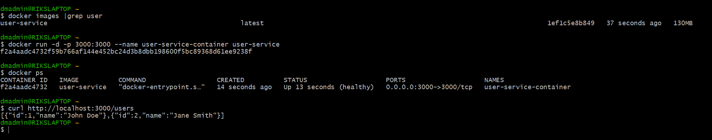
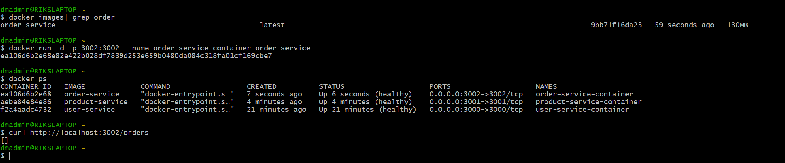

# Introduction 

This ```md``` file contains detailed steps how to build micro service using Docker (```Dockerfile``` and ```docker-compose.yml```) and tested using Docker Desktop locally.

## 1. Dockerfile Creation,Build and Test 
Create a Dockerfile for each service and test it individually.

### 1.1. User-service 



### 1.2. Product-service


### 1.3. Order-service



### 1.4. Gateway-service


> ***Note*** - ```curl http://localhost:3003/api/users``` or any other gateway service result in error as each container is hosted on its own container network. 
>1. Create ```docker network create myapp-network``` and run each container again against that network to make gateway api works. 
>2. Sample example ```docker run -d --network myapp-network -p 3003:3003 --name gateway-service-container gateway-service```

## 2.  Docker Compose Creation,Build and Test 

### 2.1. docker-compose.yml 
Create a docker compose yml file and use below commands to build and test it 

```bash
# Build and start all services
docker-compose up -d

# Verify all containers are running
docker-compose ps

# View logs for all services
docker-compose logs -f

# Stop all services
docker-compose down
```

> ***Note*** - in case you are facing running any specific container use below-mentioned troubleshooting steps 
```bash
#Rebuild the Docker Images
#Run the following command to rebuild the Docker images:
docker-compose build user-service
# Debug the Build Context
docker build --no-cache -t user-service ./user-service
#Inspect the Container
docker-compose up -d user-service
docker exec -it user-service sh
ls /usr/src/app
#Clean Up Docker Cache
docker-compose down --rmi all --volumes --remove-orphans
docker-compose build --no-cache
docker-compose up
```
### 2.2. Successful build using docker-compose

### 2.3. Verified all containers are running 

### 2.4. View logs for all services

### 2.5. Test each microservice using curl 

### 2.6. Terminate the docker compose
