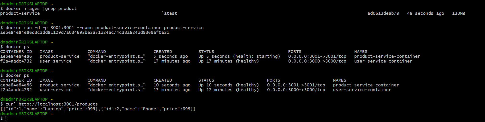
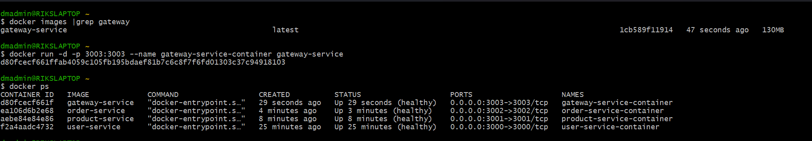

### Requirements
##  Dockerfile Creation,Build and Test 
Create a Dockerfile for each service and test it individually.

### User-service 


### Product-service




### Order-service


### Gateway-service



> ***Note*** - ```curl http://localhost:3003/api/users``` or any other gateway service result in error as each container is hosted on its own container network. 
>1. Create ```docker network create myapp-network``` and run each container again against that network to make gateway api works. 
>2. Sample example ```docker run -d --network myapp-network -p 3003:3003 --name gateway-service-container gateway-service```

##  Docker Compose Creation,Build and Test 


